# Project Design Document

## Section 1 - Project Description

### 1.1 Project

Team work and task management web application - Simple Work

### 1.2 Description

A simplified Trello-style team management web application. The app allows teams to create workspaces, define project scopes within those teams, and manage project states and tasks in a multi-layered, flexible system. It features task-level comments with nested replies, and enables seamless drag-and-drop rearrangement of tasks between states and prioritization of states within a project

 

## Section 2 - Library and Database

|Item|Framework, Library, Database|
|-|-|
|Framework| React-Vite|
|Database| Firebase|
|Library| MUI, tailwindCSS|

 

## Section 3 - Features and Functionalities
|Item| Features, Functionalities|
|-|-|
|1|Support account creation with signup and login|
|2|Support guest trials account creation with auto delete after expiration|
|3|Support team creation into workspace and adding team members|
|4|Support project creation for members within team|
|5|Support states creation for each project|
|6|Support tasks creation within state|
|7|Support drag and drop feature for task rearrangment to different state|
|8|Support drag and drop feature for state priority rearrangement|
|9|Support account name, password modification|

 

## Section 4 - Project Top Level Diagram

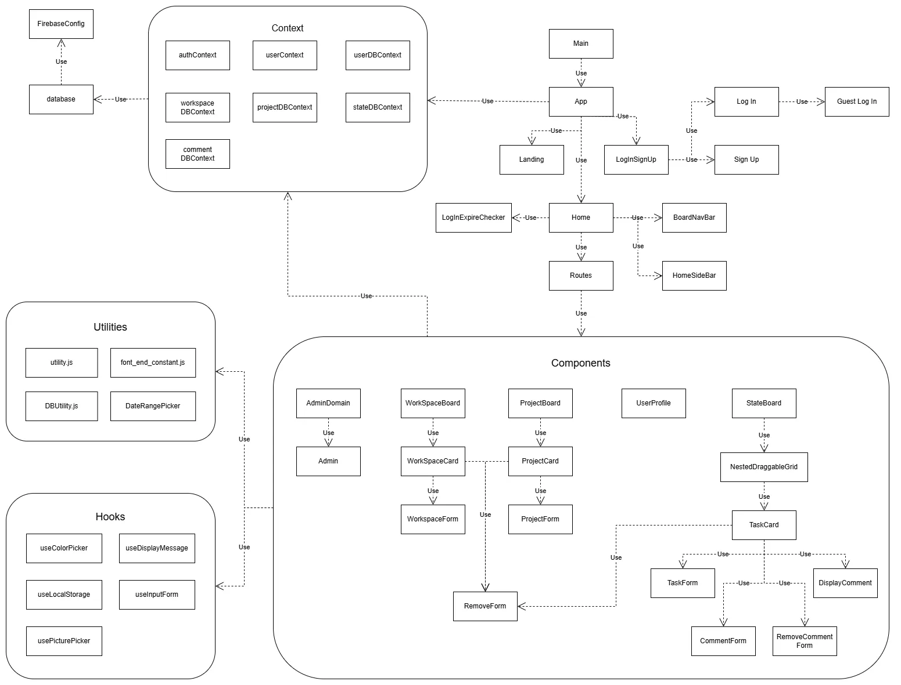

 

## Section 5 - Database UML

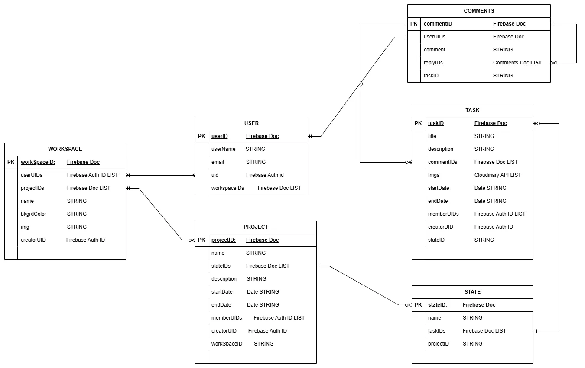

 

## Section 6 - UI
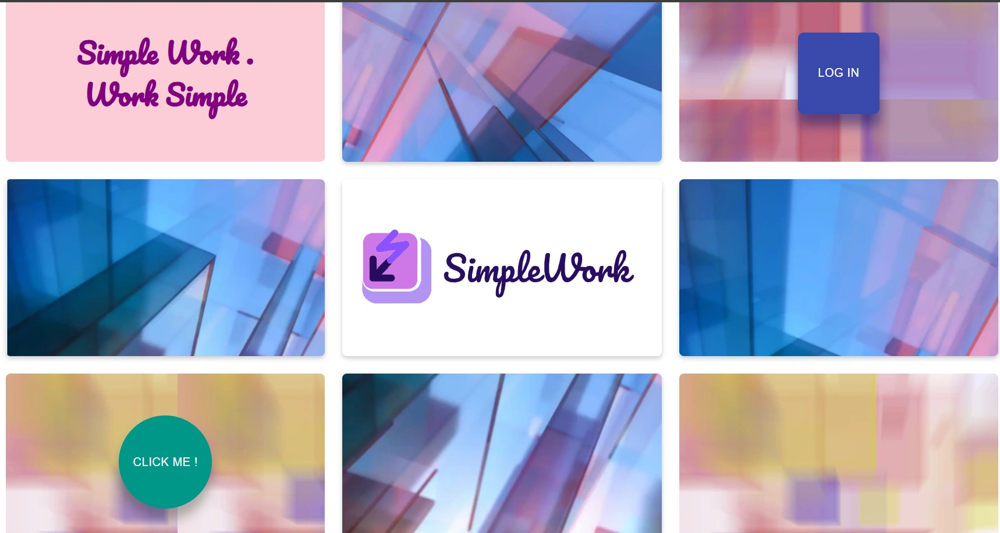
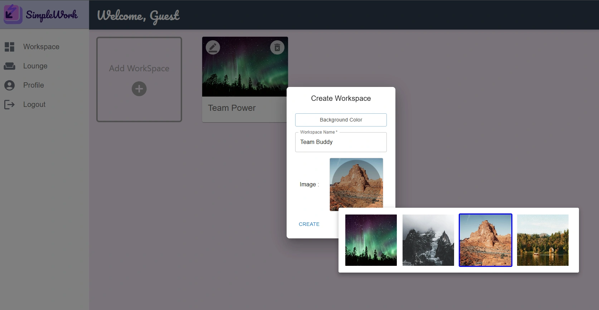
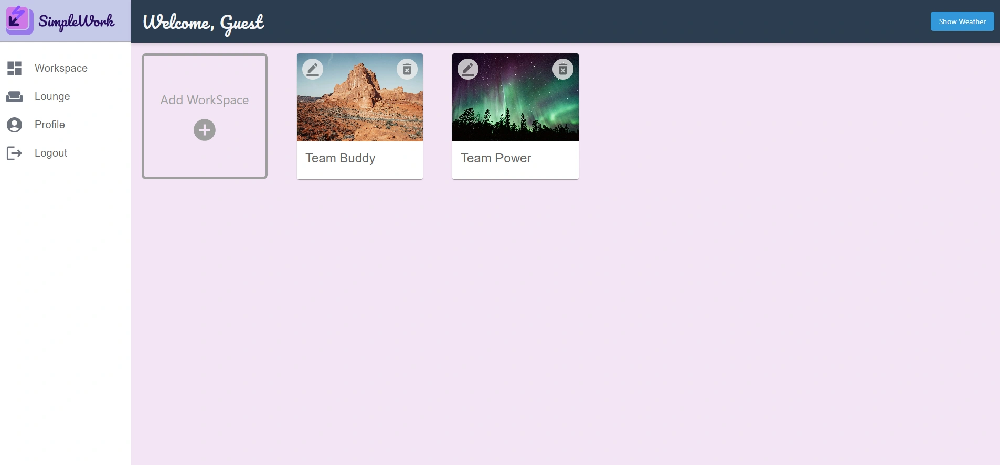
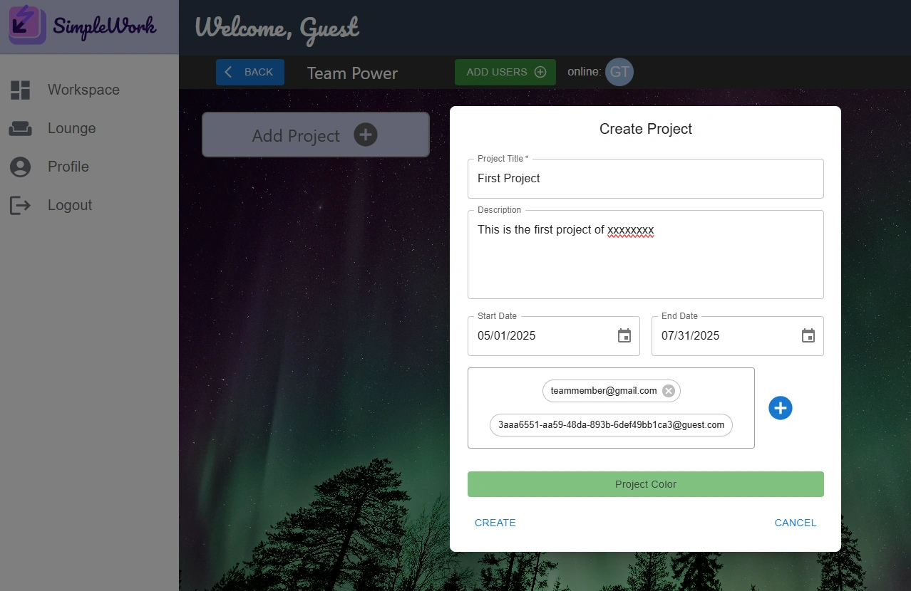
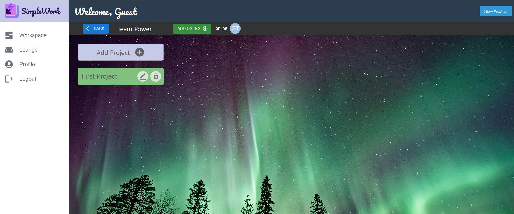
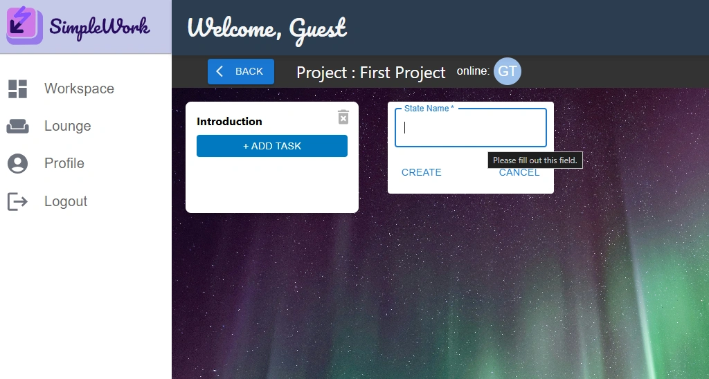
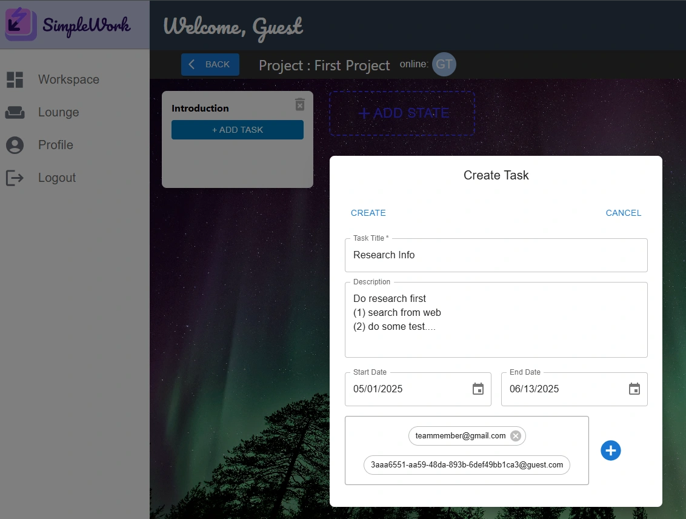
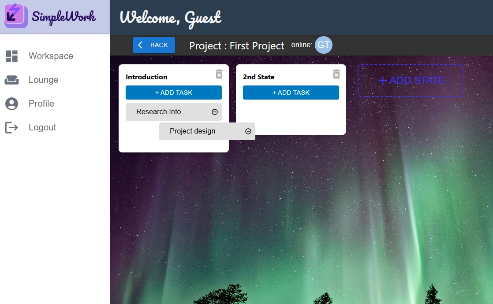
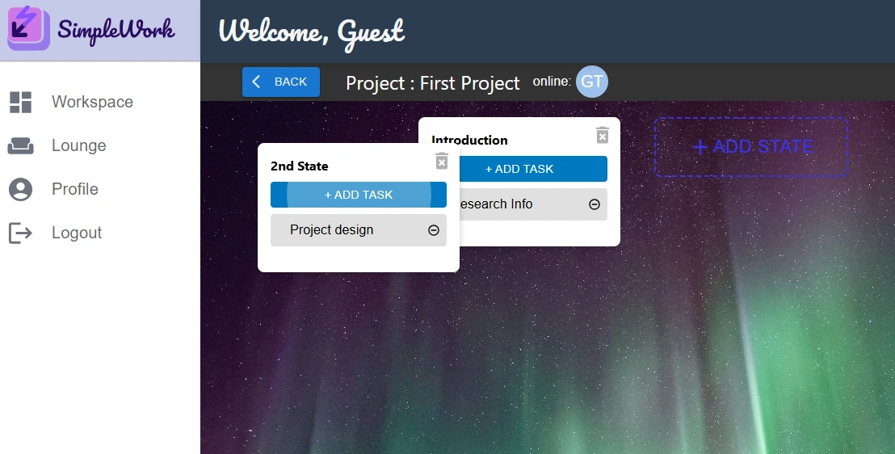
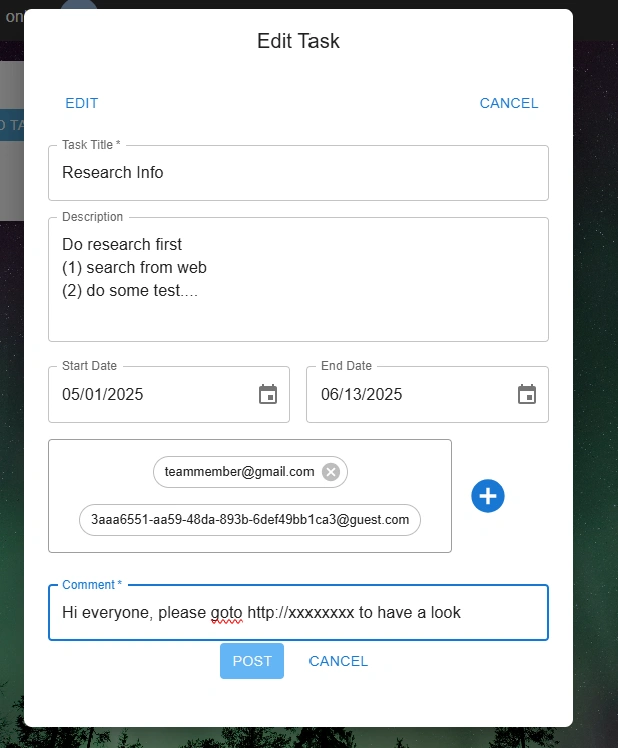
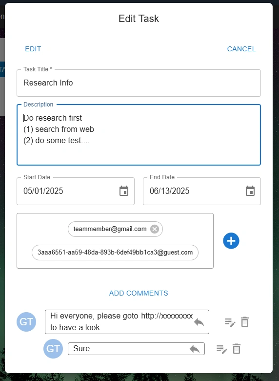

## END of Document

